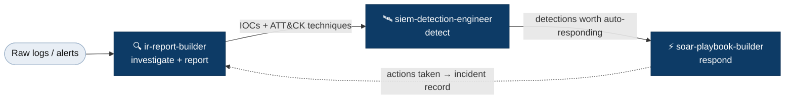
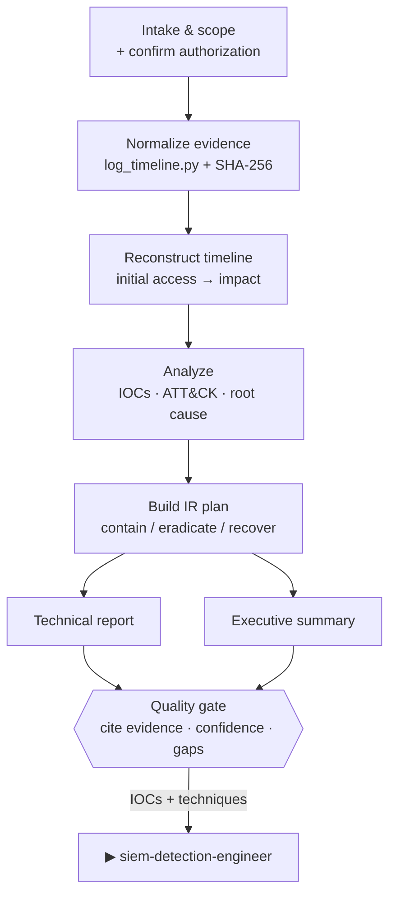
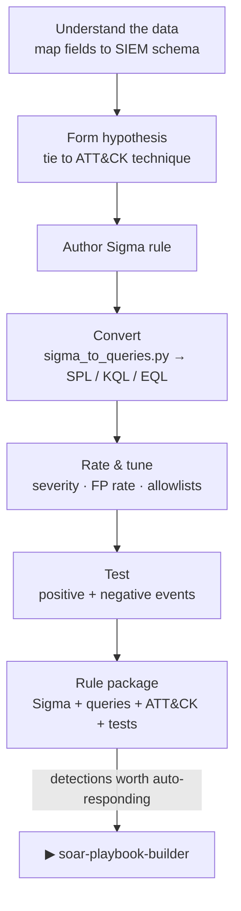
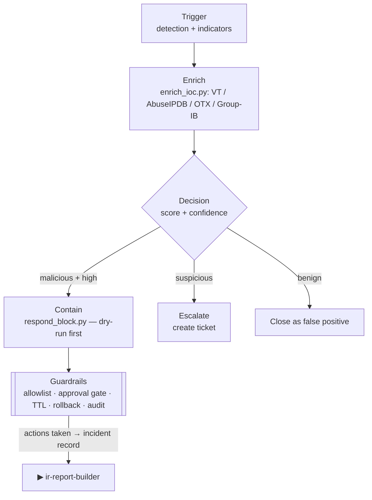

# Defensive SOC Skills for Claude Code

A suite of three **original** Claude Code / Agent Skills for blue-team / SOC work.
They form a pipeline: **investigate → detect → respond**.

> 📖 **Full usage guide → [MANUAL.md](MANUAL.md)** (install, how each skill activates, helper-script CLI usage, FAQ)

| Skill | What it does | Handoff |
|---|---|---|
| **ir-report-builder** | Analyze all logs → attack timeline, IR plan (NIST 800-61 / PICERL), detailed technical report + executive summary | IOC + technique → detection |
| **siem-detection-engineer** | From data / attack behavior → author Sigma rules, then convert to SPL / KQL / EQL / QRadar / Wazuh + MITRE ATT&CK mapping + false-positive estimate | detection → response |
| **soar-playbook-builder** | Build SOAR playbooks that call device APIs (Firewall/WAF/IPS/DLP) for automated blocking + threat-intel enrichment (VirusTotal/AbuseIPDB/OTX/Group-IB), with guardrails & rollback | actions → incident record |

---

## Pipeline at a glance



---

## How each skill works

### 🔍 ir-report-builder — investigate & report
Follows NIST SP 800-61 and SANS PICERL, mapping observed behavior to MITRE ATT&CK.



1. **Intake & scope** — confirm incident type, affected assets, detection time,
   available data sources, and authorization.
2. **Normalize evidence** — `log_timeline.py` parses every log format (syslog, JSON,
   CSV, CEF, access, FortiGate KV, CloudTrail) into one timezone-aligned timeline and
   records a SHA-256 of each source file for chain of custody.
3. **Reconstruct the timeline** — order events and flag initial access, lateral
   movement, privilege escalation, impact, and last observed activity.
4. **Analyze** — extract IOCs, map each step to an ATT&CK technique, determine root
   cause, and assess blast radius.
5. **Build the IR plan** — concrete Containment / Eradication / Recovery actions with
   owners and priority (already-done vs. recommended).
6. **Write two deliverables** — a dense, evidence-cited technical report and a
   one-page executive summary that leads with business impact.
7. **Quality gate** — every claim cites an evidence line; inferences are labeled with
   confidence; visibility gaps are listed explicitly.

→ *Handoff:* IOCs and techniques feed **siem-detection-engineer**.

### 🛰️ siem-detection-engineer — detect
Sigma is the source of truth; platform queries are generated from it.



1. **Understand the data** — align the log source and its fields to the target SIEM
   schema using `resources/log-source-mapping.md` (the #1 cause of dead rules).
2. **Form the hypothesis** — *"detect \<technique\> by observing \<signal\> in \<log
   source\>"*, tied to an ATT&CK technique ID.
3. **Author the Sigma rule** — precise selection/filter logic and an honest
   `falsepositives` section.
4. **Convert** — `sigma_to_queries.py` produces first-pass SPL / KQL / EQL for
   hand-review.
5. **Rate & tune** — assign severity and expected false-positive rate; define
   allowlists, thresholds, and aggregation windows.
6. **Test** — provide a positive (should fire) and negative (should not) test event.
7. **Document for handoff** — a rule package: Sigma + converted queries + ATT&CK
   mapping + FP notes + test cases + deploy/rollback note.

→ *Handoff:* detections worth auto-responding to feed **soar-playbook-builder**.

### ⚡ soar-playbook-builder — respond
Safety-first automation: enrich before acting, gate blast radius, keep everything reversible.



1. **Define the trigger** — the detection/alert that starts the playbook and its indicators.
2. **Enrich** — `enrich_ioc.py` queries VirusTotal / AbuseIPDB / OTX / Group-IB and
   computes an aggregate risk score and confidence.
3. **Decide** — explicit, ordered rules (e.g. malicious + high confidence → block;
   suspicious → escalate; else → close as FP).
4. **Respond** — `respond_block.py` calls the device API (Cloudflare / Palo Alto /
   FortiGate / CrowdStrike) with **dry-run by default**, a TTL/expiry, and a rollback action.
5. **Guardrails** — never-block allowlist, max-actions circuit breaker, approval gate
   for production, and full audit logging.
6. **Emit the playbook** — a vendor-neutral `playbook-template.yml` (trigger →
   enrich → decision → actions → guardrails → rollback).
7. **Test plan** — a dry-run walkthrough showing the exact API calls that *would* fire.

→ *Handoff:* actions taken feed back into **ir-report-builder** for the incident record.

---

## ⚠️ Authorization & safety

For **authorized defensive use only** — systems you own or are engaged to protect.
- Preserve evidence integrity; work on copies of logs.
- The SOAR response scripts are **dry-run by default** and enforce a never-block
  allowlist. Automation that blocks production traffic can cause outages — review
  before flipping `--commit`.

---

## What's original here

Every skill, script, and template in this repo is written from scratch for this
suite. No third-party skill content is bundled. External *tools and services*
(VirusTotal, MITRE ATT&CK, Sigma, vendor APIs) are only referenced/integrated, not
redistributed, and remain under their own terms.

## Included, working helper scripts (stdlib-only, no pip install)

| Script | Purpose | Verified |
|---|---|---|
| `ir-report-builder/scripts/log_timeline.py` | Normalize syslog (RFC3164/5424) / JSON / CSV / CEF / access / FortiGate KV / AWS CloudTrail into one sorted timeline + SHA-256 chain of custody | ✅ |
| `siem-detection-engineer/scripts/sigma_to_queries.py` | First-pass Sigma → SPL/KQL/EQL conversion | ✅ |
| `soar-playbook-builder/scripts/enrich_ioc.py` | Multi-source IOC reputation (VT/AbuseIPDB/OTX/Group-IB) | ✅ |
| `soar-playbook-builder/scripts/respond_block.py` | Block/unblock via Cloudflare / Palo Alto / FortiGate / CrowdStrike, dry-run + allowlist guard | ✅ |

---

## Install

```bash
git clone https://github.com/arttapon1/defensive-soc-skills.git
cd defensive-soc-skills
./install.sh          # copies the 3 skills into ~/.claude/skills/
```

Or manually:
```bash
cp -R skills/* ~/.claude/skills/
```

Start a new Claude Code session, then just describe the task — e.g. *"analyze these
logs and write an IR report"*, *"write a detection rule for this incident"*, *"build
a playbook to block this IP on the firewall"* — and the matching skill activates.

## License
MIT — see [LICENSE](LICENSE). You wrote it; you own it.
